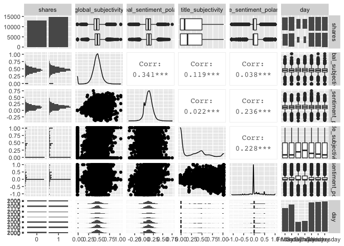

Project 2
================
Ciara Whipp
6/29/2020

## Introduction

The **OnlineNewsPopularity** data set has a total of 61 variables. There
are 2 non-predictive variables, 58 predictive variables, and 1 target
variable. The purpose of this program is to explore how well two
different types of models, a liner regression model and an ensemble
model, predict the `shares` (target) variable. To do so, we will
separate the **OnlineNewsPopularity** data set into training and testing
data sets and use the training data set to train the models. Then, we
will test the models using the testing data set and compare the accuracy
of the two models. We will automate the Rmarkdown file to repeat this
process and create a report for each day of the week.

## Data

I will use the variables
`global_subjectivity`,`global_sentiment_polarity`, `title_subjectivity`,
and `title_sentiment_polarity` to create the two predictive models.
`global_subjectivity`measures text subjectivity and `title_subjectivity`
measures title subjectivity. Both variables take on values between 0 and
1 . The variable `global_sentiment_polarity` measures text sentiment
polarity and takes on values between -0.39375 and 0.727840909.
`title_sentiment_polarity` measures title polarity and takes on values
between -1 and 1. For the polarity variables, where positive values
represent positive sentiments, negative values represent negative
sentiments, and 0 is neutral.

Read in **OnlineNewsPopularity.csv**. The data set was download from
[this
website](https://archive.ics.uci.edu/ml/datasets/Online+News+Popularity).
Create a new variable called `day` to indicate the day of the week the
article was publsiehd. Keep the `shares` variable, the four predictor
variables mentioned above, and the new `day` variable. Change `shares`
into a binary classification by splitting it into two groups - \<1400
will be represented as 0 and ≥1400 will be represented as 1.

``` r
newsData <- read_csv("OnlineNewsPopularity.csv") %>% 
    mutate(day=ifelse(weekday_is_monday==1, "Monday",
                ifelse(weekday_is_tuesday==1,"Tuesday",
                    ifelse(weekday_is_wednesday==1,"Wednesday",
                        ifelse(weekday_is_thursday==1,"Thursday",
                            ifelse(weekday_is_friday==1,"Friday",
                                ifelse(weekday_is_saturday==1,"Saturday",
                                    "Sunday"))))))) %>%
  select(shares, global_subjectivity, global_sentiment_polarity,
         title_subjectivity, title_sentiment_polarity, day)
newsData$shares <- ifelse(newsData$shares<1400, "0", "1")
newsData$shares <- as.factor(newsData$shares)
```

Split the **newsData** data set into training and testing data sets.

``` r
set.seed(1)
train <- sample(1:nrow(newsData), size=nrow(newsData)*0.7)
test <- dplyr::setdiff(1:nrow(newsData), train)

newsDataTrain <- newsData[train, ]
newsDataTest <- newsData[test, ]
```

## Summarization

### Summary Statistics

The summary statistics tables for the training data give the minimum,
1st quantile, median, mean, 3rd quantile, and maximum for
`global_subjectivity`,`global_sentiment_polarity`, `title_subjectivity`,
and `title_sentiment_polarity` for \<1400 shares and ≥1400 shares
respectively.

``` r
newsDataLt <- newsDataTrain %>%
  filter(shares=="0") %>%
  select(global_subjectivity, global_sentiment_polarity,
         title_subjectivity, title_sentiment_polarity)
knitr::kable(apply(newsDataLt,2,summary), digits=2,
             caption="Summary Statisitics for <1400 Shares in Training Data")
```

|         | global\_subjectivity | global\_sentiment\_polarity | title\_subjectivity | title\_sentiment\_polarity |
| ------- | -------------------: | --------------------------: | ------------------: | -------------------------: |
| Min.    |                 0.00 |                      \-0.39 |                0.00 |                     \-1.00 |
| 1st Qu. |                 0.38 |                        0.05 |                0.00 |                       0.00 |
| Median  |                 0.44 |                        0.11 |                0.10 |                       0.00 |
| Mean    |                 0.43 |                        0.11 |                0.27 |                       0.05 |
| 3rd Qu. |                 0.50 |                        0.17 |                0.50 |                       0.14 |
| Max.    |                 1.00 |                        0.73 |                1.00 |                       1.00 |

Summary Statisitics for \<1400 Shares in Training Data

``` r
newsDataGt <- newsDataTrain %>%
  filter(shares=="1") %>%
  select(global_subjectivity, global_sentiment_polarity,
         title_subjectivity, title_sentiment_polarity)
knitr::kable(apply(newsDataGt,2,summary), digits=2,
             caption="Summary Statisitics for ≥1400 Shares in Training Data")
```

|         | global\_subjectivity | global\_sentiment\_polarity | title\_subjectivity | title\_sentiment\_polarity |
| ------- | -------------------: | --------------------------: | ------------------: | -------------------------: |
| Min.    |                 0.00 |                      \-0.38 |                0.00 |                     \-1.00 |
| 1st Qu. |                 0.41 |                        0.07 |                0.00 |                       0.00 |
| Median  |                 0.46 |                        0.13 |                0.17 |                       0.00 |
| Mean    |                 0.45 |                        0.13 |                0.29 |                       0.08 |
| 3rd Qu. |                 0.51 |                        0.18 |                0.50 |                       0.20 |
| Max.    |                 1.00 |                        0.65 |                1.00 |                       1.00 |

Summary Statisitics for ≥1400 Shares in Training Data

## Plots

Use `ggpairs` to create graphs that show relationships between numeric
variables and summary graphs for character variables and numerical
variables by categories of the character variables.

``` r
GGally::ggpairs(newsDataTrain)
```

<!-- -->

## Modeling

### Ensemble Model - Tree Bag

This tree bag model aims to predict the `shares` category based on
`global_subjectivity`,`global_sentiment_polarity`, `title_subjectivity`,
and `title_sentiment_polarity`. The `preProcess` agrument standardizes
the
variables.

``` r
treeBagFit <- train(shares~ global_subjectivity*global_sentiment_polarity*
                 title_sentiment_polarity*title_subjectivity, 
               data=newsDataTrain, 
               method="treebag",
               preProcess=c("center", "scale"))
treeBagFit
```

Use the `predict` function to predict the `shares` variable in the
**newsDataTest** data set. `confusionMatrix` compares the predicted
values to the actual values in the data set and provides the accuracy of
the model.Accuracy and misclassification rate (1-accuracy) are used to
evaluate how well the model predicts `shares` in **newsDataTest**.

``` r
treeBagPred <- predict(treeBagFit, newdata=newsDataTest)
confusionMatrix(treeBagPred, newsDataTest$shares)
```

    ## Confusion Matrix and Statistics
    ## 
    ##           Reference
    ## Prediction    0    1
    ##          0 2243 2042
    ##          1 3337 4272
    ##                                           
    ##                Accuracy : 0.5478          
    ##                  95% CI : (0.5388, 0.5567)
    ##     No Information Rate : 0.5309          
    ##     P-Value [Acc > NIR] : 0.0001136       
    ##                                           
    ##                   Kappa : 0.0796          
    ##                                           
    ##  Mcnemar's Test P-Value : < 2.2e-16       
    ##                                           
    ##             Sensitivity : 0.4020          
    ##             Specificity : 0.6766          
    ##          Pos Pred Value : 0.5235          
    ##          Neg Pred Value : 0.5614          
    ##              Prevalence : 0.4691          
    ##          Detection Rate : 0.1886          
    ##    Detection Prevalence : 0.3603          
    ##       Balanced Accuracy : 0.5393          
    ##                                           
    ##        'Positive' Class : 0               
    ## 

### Linear Regression Model - Logistic Regression

Since our target variable is binary, we can use the binomial
distribution to fit a logistic regression model. I choose to model
`shares` by the all combinations of main effects and interactions of
`global_subjectivity` and `global_sentiment_polarity`, all combinations
of main effects and interactions of `global_sentiment_polarity` and
`title_sentiment_polarity`, and the main effect of `title_subjectivity`.

``` r
glmFit <- glm(shares ~ global_subjectivity*global_sentiment_polarity + 
                global_sentiment_polarity*title_sentiment_polarity +
                title_subjectivity,
              data=newsDataTrain,
              family="binomial")
summary(glmFit)
```

    ## 
    ## Call:
    ## glm(formula = shares ~ global_subjectivity * global_sentiment_polarity + 
    ##     global_sentiment_polarity * title_sentiment_polarity + title_subjectivity, 
    ##     family = "binomial", data = newsDataTrain)
    ## 
    ## Deviance Residuals: 
    ##     Min       1Q   Median       3Q      Max  
    ## -1.8770  -1.2141   0.9735   1.1229   1.4219  
    ## 
    ## Coefficients:
    ##                                                    Estimate Std. Error z value
    ## (Intercept)                                        -0.39529    0.05536  -7.140
    ## global_subjectivity                                 0.83315    0.12501   6.664
    ## global_sentiment_polarity                          -0.04180    0.50313  -0.083
    ## title_sentiment_polarity                            0.26930    0.06820   3.949
    ## title_subjectivity                                  0.10611    0.03952   2.685
    ## global_subjectivity:global_sentiment_polarity       2.10582    0.99083   2.125
    ## global_sentiment_polarity:title_sentiment_polarity  0.26036    0.40676   0.640
    ##                                                    Pr(>|z|)    
    ## (Intercept)                                        9.30e-13 ***
    ## global_subjectivity                                2.66e-11 ***
    ## global_sentiment_polarity                           0.93379    
    ## title_sentiment_polarity                           7.86e-05 ***
    ## title_subjectivity                                  0.00725 ** 
    ## global_subjectivity:global_sentiment_polarity       0.03356 *  
    ## global_sentiment_polarity:title_sentiment_polarity  0.52212    
    ## ---
    ## Signif. codes:  0 '***' 0.001 '**' 0.01 '*' 0.05 '.' 0.1 ' ' 1
    ## 
    ## (Dispersion parameter for binomial family taken to be 1)
    ## 
    ##     Null deviance: 38335  on 27749  degrees of freedom
    ## Residual deviance: 38032  on 27743  degrees of freedom
    ## AIC: 38046
    ## 
    ## Number of Fisher Scoring iterations: 4

Use `prediect` to predict probability of having \<1400 shares. Map
probabilities less than 0.5 to \<1400 shares or 0, and probabilities of
greeater than or equal to 0.5 to ≥1400 shares or 1. Use
`confusionMatrix` to determine the accuracy of the model. Accuracy and
misclassification rate (1-accuracy) are used to evaluate how well the
model predicts `shares` in **newsDataTest**.

``` r
glmPred <- predict(glmFit, newdata=newsDataTest, type="response")
glmPred <- ifelse(glmPred<0.5, "0", "1")
glmPred <- as.factor(glmPred)
confusionMatrix(glmPred, newsDataTest$shares)
```

    ## Confusion Matrix and Statistics
    ## 
    ##           Reference
    ## Prediction    0    1
    ##          0 1446 1215
    ##          1 4134 5099
    ##                                           
    ##                Accuracy : 0.5503          
    ##                  95% CI : (0.5413, 0.5592)
    ##     No Information Rate : 0.5309          
    ##     P-Value [Acc > NIR] : 1.123e-05       
    ##                                           
    ##                   Kappa : 0.0688          
    ##                                           
    ##  Mcnemar's Test P-Value : < 2.2e-16       
    ##                                           
    ##             Sensitivity : 0.2591          
    ##             Specificity : 0.8076          
    ##          Pos Pred Value : 0.5434          
    ##          Neg Pred Value : 0.5523          
    ##              Prevalence : 0.4691          
    ##          Detection Rate : 0.1216          
    ##    Detection Prevalence : 0.2237          
    ##       Balanced Accuracy : 0.5334          
    ##                                           
    ##        'Positive' Class : 0               
    ## 

## Automation

The following code chunk is to automate the html reports for each day of
the week. Create a variable, **days**, that contains all the unique
values of **day** variable in the **newsData** data set and create a
file name (the output files) for each day.

``` r
weekDays <- unique(newsData$day)
outputFile <- paste0(days, ".html")
params = lapply(weekDays, FUN=function(x){list(day=x)})
reports <- tibble(outputFile, params)
apply(reports, MARGIN=1,
      FUN=function(x){
        render(input="README.Rmd", output_file=x[[1]], params=x[[2]])
      })
```
